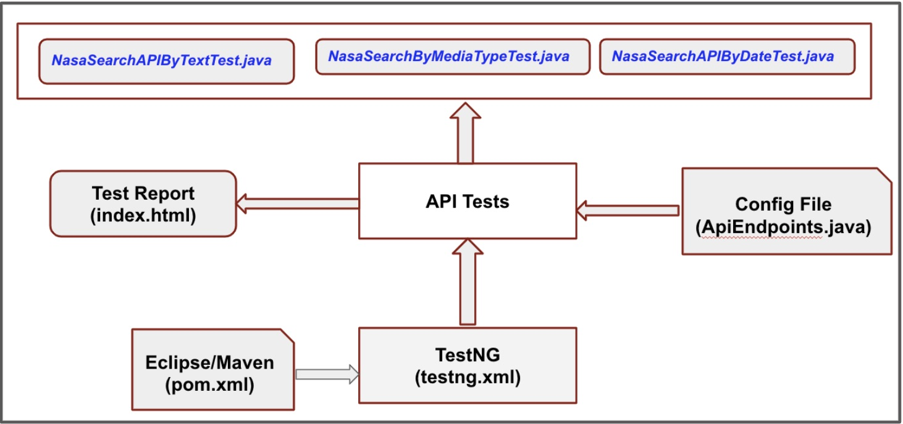

NASA Search EndPoint Tests
=======================

- [Objective](#objective)
- [Scope](#scope)
- [Test Strategy](#test-strategy)
  * [REST EndPoints](#rest-endpoints)
  * [Functional Testing](#functional-testing)
  * [Test Cases](#test-cases)
  * [Automation RestAssured Test Framework](#Automation-RestAssured-Test-Framework)
  * [Automation Testing](#automation-testing)
  * [Performance Testing](#performance-testing)
  * [Security Testing](#security-testing)
- [Issues found / ambiguities](#issues-found---ambiguities)
- [Test Environment](#test-environment)
- [Future enhancements to automation framework](#future-enhancements-to-automation-framework)

# Objective

The test plan is designed to validate the REST endpoint GET [https://images-api.nasa.gov/search](https://images-api.nasa.gov/search) with query parameters “q”, “media_type”, “start_year” and “end_year” based on the requirements stated in the api document

[https://images.nasa.gov/docs/images.nasa.gov_api_docs.pdf](https://images.nasa.gov/docs/images.nasa.gov_api_docs.pdf)

# Scope

  Testing the GET [https://images-api.nasa.gov/search](https://images-api.nasa.gov/search) with query parameters “q”, “media_type”, “start_year” and “end_year”.

# Test Strategy

## REST EndPoints

1.  GET [https://images-api.nasa.gov/search](https://images-api.nasa.gov/search)
    
2.  GET [https://images-api.nasa.gov/search](https://images-api.nasa.gov/search)?q=<no text | null>
    
3.  GET [https://images-api.nasa.gov/search](https://images-api.nasa.gov/search)?q=<valid|invalid text>
    
4.  GET [https://images-api.nasa.gov/search](https://images-api.nasa.gov/search)?media_type=<audio|image|video>
    
5.  GET [https://images-api.nasa.gov/search](https://images-api.nasa.gov/search)?q=<text>\&year_start=<year between 1921 to 2021>
    
6.  GET [https://images-api.nasa.gov/search](https://images-api.nasa.gov/search)?q=<text>\&year_end=<year between 1921 to 2021>
    
7.  GET [https://images-api.nasa.gov/search](https://images-api.nasa.gov/search)?q=<text>\&media_type=<media>\&start_year=<date>\&end_year=<date>
    

## Functional Testing

## Test Cases

The complete test cases for NASA Search Endpoints are listed as part of 
[doc/NASA_Search_API_Test_Plan.pdf](https://github.com/sriumavadivel/nasa-search-endpoint-tests/blob/main/doc/NASA_Search_API_Test_Plan.pdf)

## Automation RestAssured Test Framework



## Automation Testing

Automation test cases were added for the following functional scenarios.

  __NasaSearchAPIByTextTest__

1.  happy path - search by valid text in lowercase
    
2.  happy path - search by valid text in uppercase
    
3.  happy path - search by valid text in mixedcase
    
4.  search by invalid text
    
5.  search text is null
    
6.  search text is empty string
    
__NasaSearchByMediaTypeTest__

1.  happy path - search by valid media type in lowercase
    
2.  happy path - search by valid media type in uppercase
    
3.  happy path - search by valid media type in mixedcase
    
4.  media type invalid text
    
5.  media type is null
    
6.  media type is empty string
    
__NasaSearchAPIByDateTest__

1.  happy path - test for optional parameters combinations
    
2.  test for optional parameters combinations and year_start is invalid
    
3.  test for optional parameters combinations and year_end is invalid
    
4.  test for optional parameters combinations and year_start is in future
    

## Performance Testing

1.  Verify response time when accessing different pages with max records.
    
2.  Verify response time when accessing same page by concurrent users
    
## Security Testing

1.  Verify the endpoint can be accessed with no headers and authorization sent in request
    
2.  Verify the response headers for the below set (verification for cross origin resource sharing)
```    
Access-Control-Allow-Origin: *

Access-Control-Allow-Headers: Origin,Content-Type,Accept,Authorization,X-Requested-With

Access-Control-Allow-Methods:GET
```
3.  SQL injection and verify the response
    

# Issues found / ambiguities

  

1.  When sending null or empty string in the optional parameters q or media_type, the response codes returned are inconsistent
	   *  [https://images-api.nasa.gov/search?media_type=](https://images-api.nasa.gov/search?media_type=)<null | empty string> returns 200. Expected: 400. 
	  *   [https://images-api.nasa.gov/search?q=](https://images-api.nasa.gov/search?media_type=)<null | empty string> returns 400, Expected: 400

  

2.  [https://images-api.nasa.gov/search](https://images-api.nasa.gov/search?media_type=)?q=<special characters> When sending special characters, only few characters are blocked and others fetch the records successfully.
    
	* 200 OK, returned records for the special characters ` ! @ $ % ^ * ( ) { [ ] “ ‘ \ : < >

	* 200 OK, empty items array for the special characters ~ - _ + } | . ? /

	* 400 Bad Request for the special characters # & ; ,

  

3.  Information on supported vs unsupported special characters is not stated in the api document
    
4.  Max limit of characters for search pattern string for q parameter is not stated in the api document
    
5.  API Document states the release version as 1.5.3 but api response returns version as 1.0.
    
```
{

"collection": {

"metadata": {

"total_hits": 1

},

"version": "1.0",

"items": [

{
```
  
6.  media_type in upper case is returning zero records.
    
7.  Information on api limit is not stated in the api documentation
    
8.  Limitation on date range year_start and year_end is not stated in the api document.
    
Hitting endpoint [https://images-api.nasa.gov/search?q=mars&year_start=](https://images-api.nasa.gov/search?q=mars&year_start=)<2022-2027> is returning 200.

Hitting endpoint  [https://images-api.nasa.gov/search?q=mars&media_type=video&year_start=2026](https://images-api.nasa.gov/search?q=mars&media_type=video&year_start=2026) returns 200 and the records display date created as future date
```
"items": [

{

"data": [

{

"date_created": "2027-12-16T00:00:00Z",

"center": "KSC",

"title": "Greenhouse in Antarctica Helping Astronauts on Long-Duration Missions",

"media_type": "video",

"nasa_id": "Antarctica Eden ISS",

"photographer": "NASA/Francisco Martin",

"keywords": [

"EDEN ISS",

"Meumayer II Station",

"Antarctica"

],
```
# Test Environment

__Automation Testing:__  Automation framework built with Java, TestNG, Maven, RestAssured 
__Manual Testing:__   Postman 
__Performance Testing:__  jmeter

# Future enhancements to automation framework

1.  Add utility to verify the broken links
    
2.  Add utility to generate custom report
    
3.  Add utility to parse json objects
    
4.  Add utility to generate and extract date, year
    
5.  Add utility to generate random valid and invalid texts for search patterns
